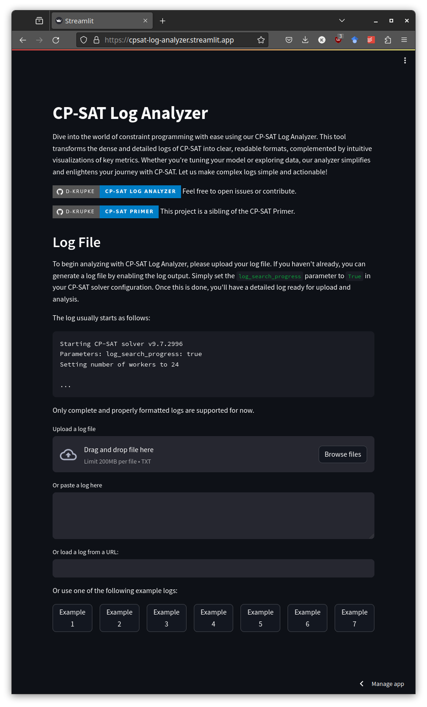
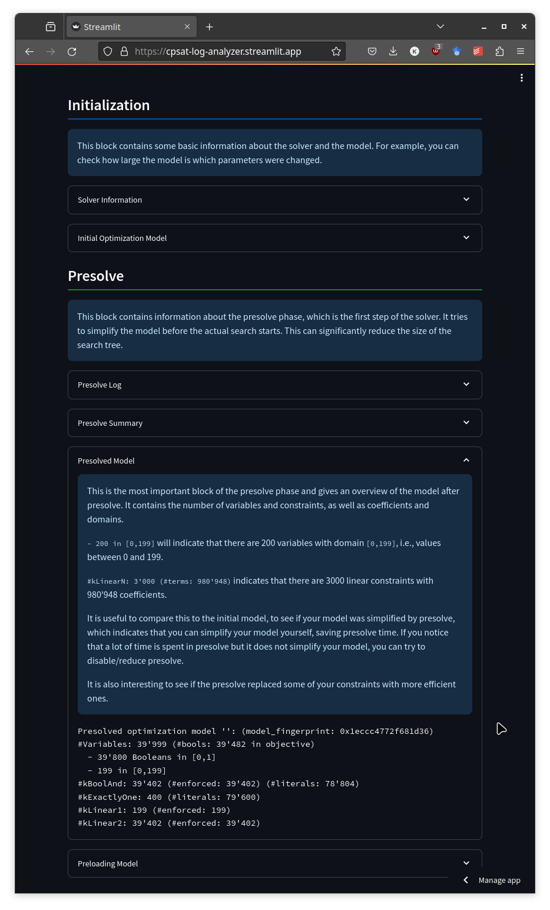
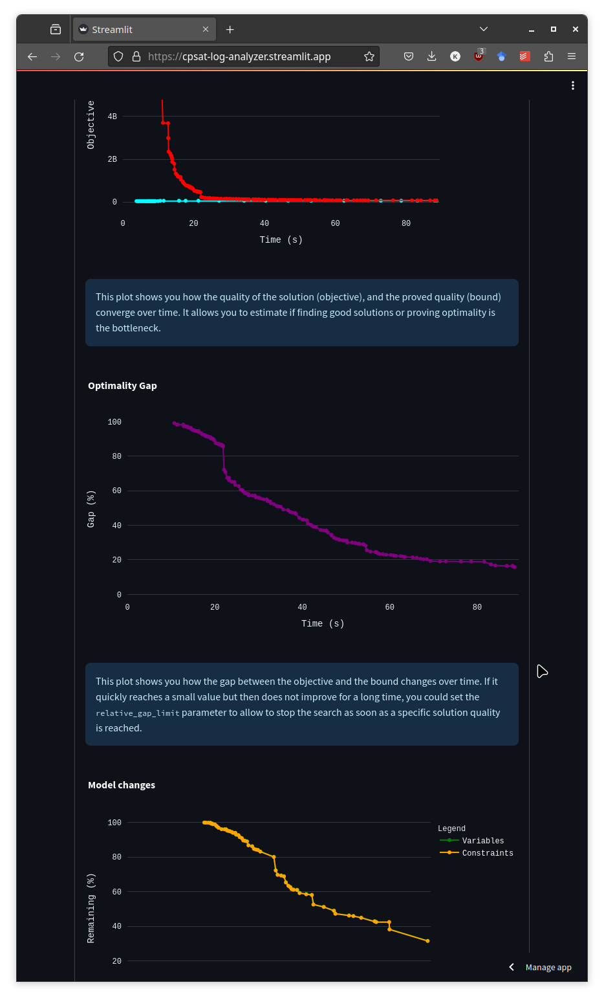

# CP-SAT-Log-Analyzer

Dive into the world of constraint programming with ease using our CP-SAT Log
Analyzer. This tool transforms the dense and detailed logs of CP-SAT into clear,
readable formats, complemented by intuitive visualizations of key metrics.
Whether you're tuning your model or exploring data, our analyzer simplifies and
enlightens your journey with CP-SAT. Let us make complex logs simple and
actionable!

[](https://cpsat-log-analyzer.streamlit.app/)

## Easy Upload

Various ways to quickly upload your log files, and multiple examples to get you
started. If you have you log file uploaded somewhere, you can also create a link
to it that you can share with others. There are some simple security measures in place to prevent abuse. Please let me know if they are too restrictive.



## Overview

The overview page gives you a quick overview of the most important metrics of
your log file.


## Documentation

The logs are not only parsed and displayed, but also explained. Hovering over
the question mark next to a metric will give you a short explanation of what it
means. The individual parts of the log are annotated with a basic explanation.



## Plotting

Some important time series are plotted to give you a better understanding of
what is going on in your log file. It is interactive, and you can zoom in and
out. The hover-text gives you context on what you are looking at.



## Tabular Data

The log contains a lot of tabular data. We parse them into nice interactive
tables.


## Contributing

We welcome contributions to this project. If you have any suggestions or
encounter any bugs, please open an issue. If you want to contribute code, please
open a pull request. We will review it as soon as possible.

## Development

You can run this project locally by cloning it and running the following
commands:

```bash
pip install -r requirements.txt
streamlit run app.py
```
